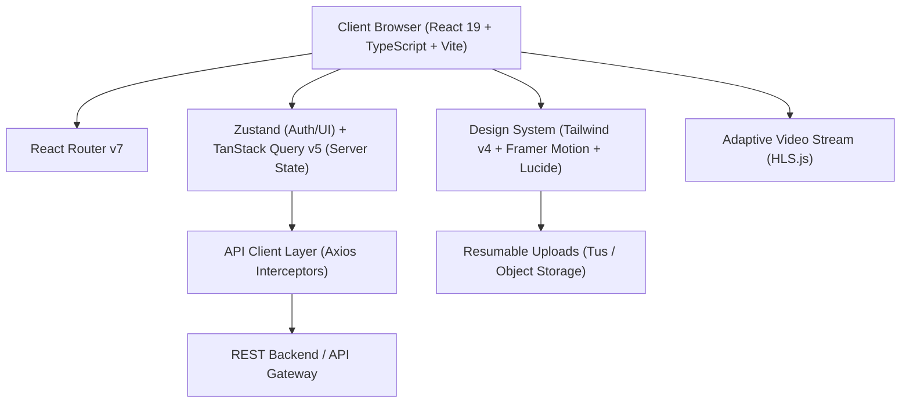
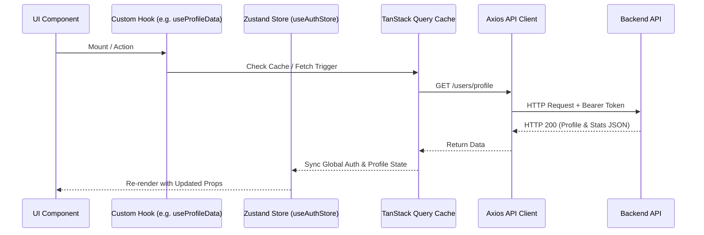

# Architecture & Design Specification: Esmat E-Learning Platform

## 1. Executive Summary

**Esmat** is a modern, high-performance E-Learning & Academic Management Platform engineered to provide seamless educational experiences for students and robust administrative capabilities for educators. Built with React 19, TypeScript, Vite, and Tailwind CSS v4, the application leverages adaptive HLS video streaming, resumable multi-part file uploads (Uppy/Tus), real-time progress analytics, and dynamic PDF certificate generation.

---

## 2. Technical Stack & System Architecture



### Core Technologies

| Layer | Technologies / Libraries | Purpose & Features |
| :--- | :--- | :--- |
| **Frontend Framework** | React 19, Vite, TypeScript 5.9 | Concurrent rendering, ultra-fast HMR, strict type safety |
| **Styling & Motion** | Tailwind CSS v4, Framer Motion 12, Lucide React | Utility-first CSS, smooth micro-interactions, iconography |
| **State Management** | Zustand 5, TanStack Query 5 | Client global state (Auth, UI) & Server cache management |
| **Media & Streaming** | HLS.js 1.6, Uppy 5, Tus Client | Adaptive bitrate video streaming & resumable chunk uploads |
| **Analytics & Export** | Recharts 3.8, jsPDF 4.2, AutoTable | Interactive visual charts & client-side PDF certificate generation |
| **Form Management** | React Hook Form 7, Zod 4, Resolver | Schema-validated forms with instant feedback |

---

## 3. UI/UX Design System & Theme Architecture

### Color Palette & Tokens

- **Primary Brand**: Deep Slate / Indigo accent (`#4F46E5` / `var(--color-indigo-600)`)
- **Secondary / Accent**: Cyan (`#06B6D4`) & Emerald (`#10B981`) for success and completion indicators
- **Surface & Glass**: Translucent slate overlays with `backdrop-blur-md` for modern glassmorphism
- **Typography**: Inter / Outfit variable fonts with hierarchical scaling

### Component Hierarchy & Design Patterns

```
src/
├── components/          # Reusable UI primitives & layout elements
│   ├── ui/              # Buttons, Cards, Inputs, Modals, Badges, Loaders
│   ├── video/           # Custom HLS Video Player with quality switch & speed controls
│   └── dashboard/       # Charts, Stats Widgets, Progress Rings
├── layouts/             # Page frame structures (MainLayout, AdminLayout, AuthLayout)
├── pages/               # Top-level view containers
│   ├── Landing.tsx      # Public showcase & course hero
│   ├── Courses.tsx      # Filterable course catalog & search
│   ├── CourseDetail.tsx # Course overview, curriculum, enrollment
│   ├── VideoCourse.tsx  # Interactive video player, lesson list, notes
│   ├── Quiz.tsx         # Timed quiz interface with instant feedback
│   ├── Exam.tsx         # Formal examination system
│   ├── Assignment.tsx   # File submission & rubric review
│   ├── Profile.tsx      # Student learning analytics & badge wallet
│   └── admin/           # Comprehensive admin suite (Dashboard, Courses, Users)
```

---

## 4. Key Functional Modules

### 4.1. Authentication & Role-Based Access Control (RBAC)

- **Authentication Flow**: Phone / Email login with JWT authentication token persistence (`localStorage` / HTTP-only cookies).
- **Roles**:
  - `student`: Standard access to enrolled courses, quizzes, assignments, and profile stats.
  - `admin`: Administrative dashboard with full CRUD operations for courses, user management, and video processing.
- **Route Guards**: Custom `ProtectedRoute` and `AdminRoute` layout wrappers enforcing permission checks prior to view rendering.

### 4.2. Adaptive Video Player & Progress Engine

- **HLS Streaming**: Auto-detection of network bandwith using `hls.js`, multi-resolution bitrate switching (1080p, 720p, 480p, 360p).
- **Playback Tracking**: Automatic heartbeat reporting progress at interval milestones (25%, 50%, 75%, 100%).
- **Interactive Features**: Timestamped note-taking, playback rate control (0.5x – 2.0x), and auto-advance to next lesson.

### 4.3. Assessment System (Quizzes, Exams & Assignments)

- **Quiz Engine**:
  - Countdown timer with automatic submission upon expiry.
  - Single-choice and multi-choice question formats.
  - Post-submission explanation breakdown and score computation.
- **Assignment Submissions**:
  - Drag-and-drop file upload utilizing Uppy/Tus protocol.
  - Real-time progress bar, file size validation, and mime-type verification.

### 4.4. Analytics & Certificate Generation

- **Profile Dashboard**: Recharts-driven weekly activity metrics, progress breakdown, and achievement badges.
- **PDF Certificate Engine**: Dynamic client-side PDF document generation using `jspdf` and `jspdf-autotable`, rendering completed course verification certificates upon 100% course completion.

---

## 5. State Management & Data Flow



---

## 6. Security, Performance & Observability

1. **Security Protections**:
   - Axios Request Interceptor injecting Authorization headers.
   - Response Interceptor capturing `401 Unauthorized` for silent token refresh or auto-logout.
   - Input sanitization via Zod schemas to prevent XSS and malformed payloads.

2. **Performance Optimizations**:
   - Code splitting with `React.lazy` and Dynamic Imports for administrative sub-routes.
   - Service Worker integration for asset caching and offline fallback capabilities.
   - Responsive image loading & WebP asset conversion via `sharp` tooling.

3. **Observability & Logging**:
   - Structured client error reporting middleware.
   - Comprehensive audit logging for administrative mutations (course creation, user role updates).

---

## 7. Future Extensibility Roadmap

- **i18n Multi-language Support**: Translation provider for Arabic (RTL) and English (LTR).
- **Live Classroom Integration**: WebRTC / Agora integration for live interactive webinars.
- **Offline PWA Download Engine**: IndexedDB local storage of encrypted video segments for offline study mode.
